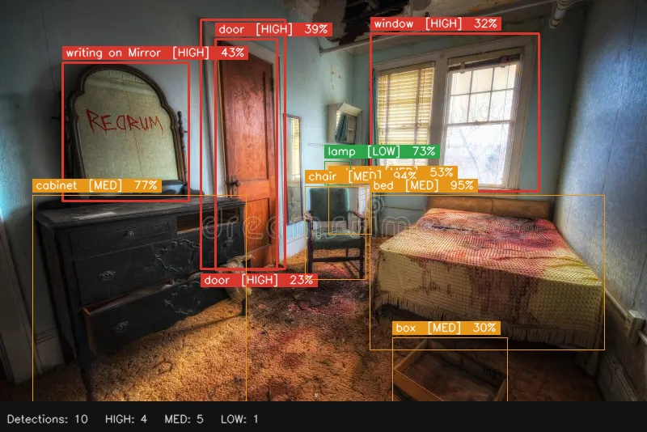

# Crime Scene Analysis Tool

An AI-powered forensic evidence detection system that analyzes crime scene images and identifies potential evidence using the YOLOE segmentation model. Built with a Flask backend and React frontend.

---

## Demo

> Add your inference/output images here. Example:

<!-- Replace the paths below with your actual image files -->



---

## Features

- Upload crime scene images via drag-and-drop or file picker
- AI detection of 50+ evidence categories using YOLOE v8L segmentation
- Evidence categorized into: **VICTIM, WEAPON, BIOLOGICAL, ENTRY, DISTURBANCE, DOCUMENT, PERSONAL, TRACE, DIGITAL, CONTAINER**
- Priority levels: **HIGH** (red), **MED** (orange), **LOW** (green) with confidence scores
- Annotated output image with bounding boxes returned in real time
- Threat level assessment (Standard / Elevated / Critical)
- Dark cyberpunk-themed UI with animated overlays

---

## Tech Stack

| Layer    | Technology                          |
|----------|-------------------------------------|
| Frontend | React 19, Vite 8                    |
| Backend  | Python, Flask, Flask-CORS           |
| AI Model | YOLOE v8L (Ultralytics)             |
| Vision   | OpenCV, Pillow                      |

---

## Project Structure

```
Crime_Scene_Analysis/
├── backend/
│   ├── server.py               # Flask API server
│   └── yoloe-v8l-seg.pt        # Model weights (not included in repo — see setup)
├── crime-scene-app/            # React + Vite frontend
│   ├── src/
│   │   ├── App.jsx             # Main React component
│   │   └── ...
│   ├── package.json
│   └── vite.config.js
├── requirements.txt            # Python dependencies
└── README.md
```

---

## Setup & Installation

### 1. Clone the repository

```bash
git clone https://github.com/your-username/Crime_Scene_Analysis.git
cd Crime_Scene_Analysis
```

### 2. Backend setup

```bash
cd backend

# Install Python dependencies
pip install -r ../requirements.txt

# Download YOLOE model weights (~1.3 GB)
wget -O yoloe-v8l-seg.pt https://huggingface.co/jameslahm/yoloe/resolve/main/yoloe-v8l-seg.pt

# Start the Flask server
python server.py
```

The backend will be available at `http://localhost:5000`.

### 3. Frontend setup

```bash
cd crime-scene-app

# Install Node.js dependencies
npm install

# Start the development server
npm run dev
```

The frontend will be available at `http://localhost:5173`.

---

## API Endpoints

| Method | Endpoint   | Description                              |
|--------|------------|------------------------------------------|
| GET    | `/health`  | Check server and model status            |
| POST   | `/analyze` | Upload an image and receive detections   |

### POST `/analyze`

**Request:** `multipart/form-data` with field `image` (image file)

**Response:**
```json
{
  "totalDetections": 12,
  "high": 4,
  "med": 5,
  "low": 3,
  "detections": [
    {
      "prompt": "gun",
      "reason": "possible firearm weapon",
      "priority": "HIGH",
      "category": "WEAPON",
      "conf": 87,
      "bbox": [x1, y1, x2, y2]
    }
  ],
  "annotatedImage": "data:image/jpeg;base64,..."
}
```

---

## Evidence Categories

| Category    | Examples                                      |
|-------------|-----------------------------------------------|
| VICTIM      | person, body, rope, handcuffs                 |
| WEAPON      | gun, knife, rifle, hammer, axe, crowbar       |
| BIOLOGICAL  | blood, blood stain                            |
| ENTRY       | door, window, glass, lock                     |
| DISTURBANCE | fallen chair, drawer, bed, cabinet            |
| DOCUMENT    | paper, note, writing, map                     |
| PERSONAL    | wallet, phone, shoe, bag, keys                |
| TRACE       | footprint, handprint, fingerprint             |
| DIGITAL     | laptop, phone, camera, monitor                |
| CONTAINER   | box, bottle                                   |

---

## Notes

- The model weights file (`yoloe-v8l-seg.pt`, ~1.3 GB) is excluded from the repository. Download it separately using the command above.
- Uploaded and annotated images are stored locally in `backend/uploads/` and `backend/annotated/` and are excluded from git.
