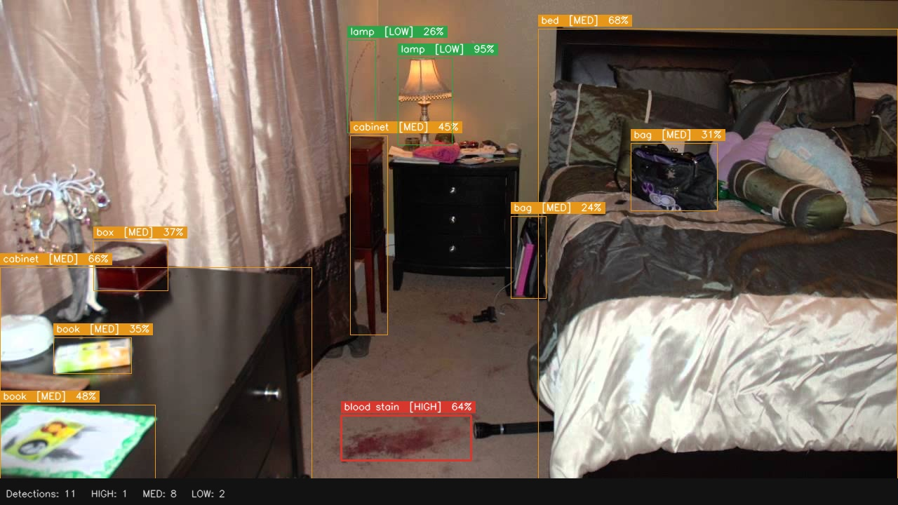
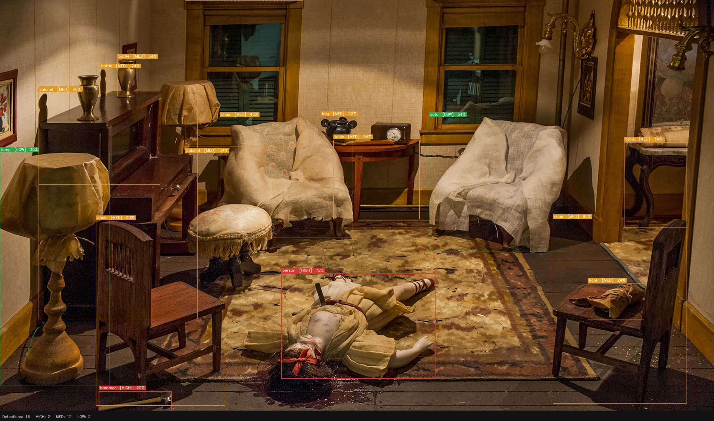

# ForensIQ — Crime Scene Analysis Tool

An AI-powered forensic evidence detection system that analyzes crime scene images and identifies potential evidence using the YOLOE segmentation model. Built with a Flask backend and React frontend.

---

## ⚠️ Disclaimer

**This tool is built strictly for educational and academic purposes.**

All images used in this project for demonstration and testing are either:
- Sourced from **movies, TV series, or web series** (fictional scenes)
- **Reconstructions and simulations** created for training forensic scientists, law enforcement personnel, or medical examiners
- Publicly available **synthetic or staged datasets** used in academic forensic research

None of the images depict real crime scenes, real victims, or actual criminal incidents. This project does not store, process, or distribute any sensitive or real forensic data. It is a student mini-project submitted as part of **BCSE301L — Software Engineering** at **VIT Vellore** and is not intended for deployment in any real-world law enforcement or investigative context.

---

## Demo

<!-- Replace the paths below with your actual image files -->



---

## How It Works

ForensIQ uses a **prompt-guided object detection** approach built on top of YOLOE (You Only Look Once — Extended), a state-of-the-art open-vocabulary segmentation model.

### Detection pipeline
```
Upload Image
     │
     ▼
Flask Backend receives image via POST /analyze
     │
     ▼
YOLOE model is given 65 forensic text prompts
("blood stain", "knife", "person", "door", ...)
     │
     ▼
Model runs a single forward pass across the image
detecting all matching objects simultaneously
     │
     ▼
Each detection is matched to its prompt metadata:
  → category  (VICTIM, WEAPON, BIOLOGICAL, ...)
  → priority  (HIGH / MED / LOW)
  → reason    (e.g. "possible firearm weapon")
  → confidence score (0–100%)
     │
     ▼
OpenCV annotates the image with bounding boxes,
priority labels, and a detection summary banner
     │
     ▼
Annotated image (base64) + ranked detections JSON
returned to the React frontend in a single response
     │
     ▼
Frontend displays annotated image alongside
a scrollable, priority-sorted evidence report
```

### Why YOLOE?

Unlike standard YOLO models that detect a fixed set of 80 COCO classes, **YOLOE supports open-vocabulary detection** — meaning it can search for arbitrary text-described objects. This makes it ideal for forensic use cases where the list of relevant evidence (blood stain, fallen chair, handcuffs, writing on mirror) goes far beyond standard object categories.

### Priority system

Every detection prompt in the system is pre-assigned a forensic priority:

| Priority | Color  | Criteria |
|----------|--------|----------|
| **HIGH** | 🔴 Red    | Direct evidence of crime — weapons, victims, biological traces, forced entry |
| **MED**  | 🟠 Orange | Contextual evidence — disturbed furniture, documents, personal belongings |
| **LOW**  | 🟢 Green  | Scene markers — lamps, sofas, general objects with low forensic value |

---

## Features

- Upload crime scene images via drag-and-drop or file picker
- AI detection of 65 evidence targets across 10 forensic categories
- Evidence categorized into: **VICTIM, WEAPON, BIOLOGICAL, ENTRY, DISTURBANCE, DOCUMENT, PERSONAL, TRACE, DIGITAL, CONTAINER**
- Priority levels: **HIGH** (red), **MED** (orange), **LOW** (green) with confidence scores
- Annotated output image with bounding boxes returned in real time
- Threat level assessment — Standard / Elevated / Critical
- Dark forensic-terminal UI with scan animations and evidence tape styling

---

## Tech Stack

| Layer    | Technology                          |
|----------|-------------------------------------|
| Frontend | React 19, Vite 8                    |
| Backend  | Python, Flask, Flask-CORS           |
| AI Model | YOLOE v8L (Ultralytics)             |
| Vision   | OpenCV, Pillow                      |

---

## Project Structure
```
ForensIQ/
├── backend/
│   ├── server.py               # Flask API server
│   └── yoloe-v8l-seg.pt        # Model weights (not included — see setup)
├── crime-scene-app/            # React + Vite frontend
│   ├── src/
│   │   ├── App.jsx             # Main React component
│   │   └── ...
│   ├── package.json
│   └── vite.config.js
├── requirements.txt            # Python dependencies
└── README.md
```

---

## Setup & Installation

### 1. Clone the repository
```bash
git clone https://github.com/Hrishikesh-Mhaiskar/ForensIQ.git
cd ForensIQ
```

### 2. Backend setup
```bash
cd backend

# Install Python dependencies
pip install -r ../requirements.txt

# Download YOLOE model weights (~1.3 GB)
wget -O yoloe-v8l-seg.pt https://huggingface.co/jameslahm/yoloe/resolve/main/yoloe-v8l-seg.pt

# Start the Flask server
python server.py
```

The backend will be available at `http://localhost:5000`.

### 3. Frontend setup
```bash
cd crime-scene-app

# Install Node.js dependencies
npm install

# Start the development server
npm run dev
```

The frontend will be available at `http://localhost:5173`.

---

## API Endpoints

| Method | Endpoint   | Description                              |
|--------|------------|------------------------------------------|
| GET    | `/health`  | Check server and model status            |
| POST   | `/analyze` | Upload an image and receive detections   |

### POST `/analyze`

**Request:** `multipart/form-data` with field `image` (image file)

**Response:**
```json
{
  "totalDetections": 12,
  "high": 4,
  "med": 5,
  "low": 3,
  "detections": [
    {
      "prompt": "gun",
      "reason": "possible firearm weapon",
      "priority": "HIGH",
      "category": "WEAPON",
      "conf": 87,
      "bbox": [120, 340, 280, 410]
    }
  ],
  "annotatedImage": "data:image/jpeg;base64,..."
}
```

---

## Evidence Categories

| Category    | Examples                                      |
|-------------|-----------------------------------------------|
| VICTIM      | person, body, rope, handcuffs                 |
| WEAPON      | gun, knife, rifle, hammer, axe, crowbar       |
| BIOLOGICAL  | blood, blood stain                            |
| ENTRY       | door, window, glass, lock                     |
| DISTURBANCE | fallen chair, drawer, bed, cabinet            |
| DOCUMENT    | paper, note, writing, map                     |
| PERSONAL    | wallet, phone, shoe, bag, keys                |
| TRACE       | footprint, handprint, fingerprint             |
| DIGITAL     | laptop, phone, camera, monitor                |
| CONTAINER   | box, bottle                                   |

---

## Notes

- Model weights (`yoloe-v8l-seg.pt`, ~1.3 GB) are excluded from the repo. Download using the `wget` command above.
- Uploaded and annotated images are stored locally in `backend/uploads/` and `backend/annotated/` and are excluded from git.
- This project was developed as a mini-project for **BCSE301L — Software Engineering** at **VIT Vellore** by Hrishikesh Mhaiskar (23BCE0455), Anupriya Singh (23BCE0652), and Hrithik Sharma (23BCE0451).